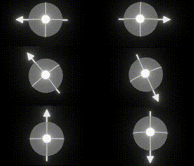
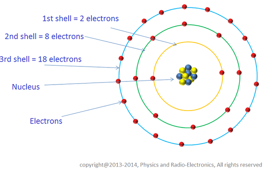
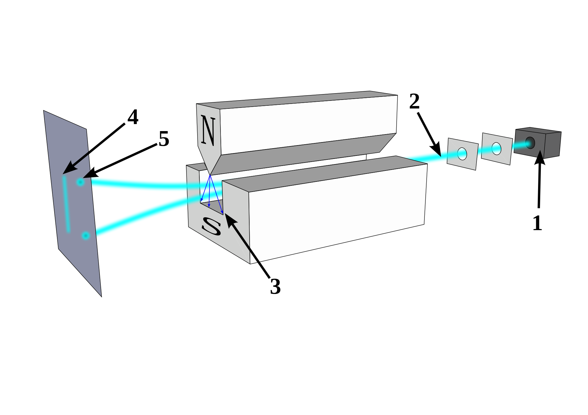
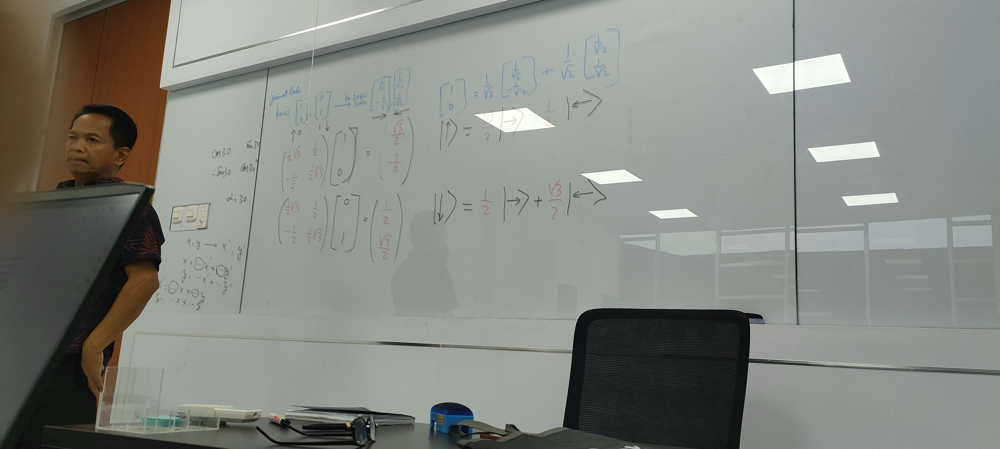

---
jupyter:
  jupytext:
    text_representation:
      extension: .md
      format_name: markdown
      format_version: '1.3'
      jupytext_version: 1.15.2
  kernelspec:
    display_name: Python 3
    language: python
    name: python3
---

# Quantum Informatics
## Basics of Quantum Theory (meeting 1-3)  

Quantum theory, just like the name, is a theory about the behaviors and properties of sub-atomic particles. In this material, we're talking about electrons. 
There are a few fundamental properties of quantum particles that we need to understand:  

### Spin  
If we heat water, the hydrogen and oxygen atoms shake in place, getting excited. As a result, they expand to occupy more space. If the heat continues, eventually the atoms will shake so much, it frees itself from the others, entering a gaseous state. This example describes that the behavior of the atoms directly affects the behavior of the matter as a whole.  

Just like the earth orbiting the sun while spinning in place, electrons also spin in place while orbiting the nucleus. They all spin in only one way, but has an infinite amount of possible angles or rotations.  

  

Why electron spins? and does it spin at a different rate? we'll leave that to the Physicists. We're programmers, we just need to know the basics, then take advantage of its properties to perform work.  

### Entanglement

Electron is a subatomic particles that orbits the nucleus in multiple levels or shells. Each shell has a maximum number of electron. The number of maximum electron in the inner-most shell is always two, and they will always be entangled. 

  

Entangled or paired electron always have opposite spins. if electron a and b are entangled, and electron a has 45deg spin (3 o-clock), then electron b will always has 315deg spin (9 o-clock) no matter what.  

Logically, since the possibilities of spin variation is infinite, we would assume that electrons has a random spin directions such as 20deg, 92deg, 145deg and so on. However, [Stern-Gerlach experiment](assets/https://en.wikipedia.org/wiki/Stern%E2%80%93Gerlach_experiment) proved otherwise. 

  

The experiment shows that **measured** electrons only appears in two states instead of randomly infinite states as suggested earlier.  
The explanation is that upon measuring the electron, the spin direction is **quantized**, meaning all infinitely possible spin directions fall into two states: north and south or 1 and 0.  
This checks out with the famous Schrodinger's Cat thought experiment.  

### Qubits  
Using these two unique properties of quantum particles, we can create a whole new circuitry out of qubits to program something.  
Normal or classical bits has 2 states, 1 and 0. but qubits can have as many as it wants, because qubits follows the spin property, which has infinite amount of possible angles or rotations.  
However, all quantum particles (therefore qubits) will be [quantized](assets/https://en.wikipedia.org/wiki/Quantization_(physics)) when measured, so they become classical bits with 1 and 0.  

## Meeting 4

  

This image shows the calculation of rotating a qubit spin and measuring its probability output.

lets say we have a pair of qubits with two basis which we want to transform into another basis:  

$$
\begin{bmatrix}  
1 \\  
0 \\  
\end{bmatrix}  
\begin{bmatrix}  
0 \\  
1 \\   
\end{bmatrix} 
\rightarrow
\begin{bmatrix}
\dfrac{1}{\sqrt{2}} \\
-\dfrac{1}{\sqrt{2}} \\
\end{bmatrix}
\begin{bmatrix}
\dfrac{1}{\sqrt{2}} \\
-\dfrac{1}{\sqrt{2}} \\
\end{bmatrix}
$$

which is equivalent to (in ket notation):  

$$
\begin{bmatrix}
\ket{\uparrow} 
\end{bmatrix}
\begin{bmatrix}
\ket{\downarrow}
\end{bmatrix}
\rightarrow
\begin{bmatrix}
\ket{\rightarrow}
\end{bmatrix}
\begin{bmatrix}
\ket{\leftarrow}
\end{bmatrix}
$$

assuming the spin direction is 90deg, and we want to rotate it 30deg, that means the alpha is 30  
$$\alpha = 30\degree$$  

Therefore we have to calculate the matrix operator by substituting the alpha into following matrix:    

$$  
\begin{bmatrix}
cos\alpha & sin\alpha  \\
-sin\alpha & cos\alpha \\ 
\end{bmatrix}=
\begin{bmatrix}
cos30 & sin30  \\
-sin30 & cos30  \\ 
\end{bmatrix}=
\begin{bmatrix}
\dfrac{1}{2}\sqrt{3} & \dfrac{1}{2}  \\
-\dfrac{1}{2} & \dfrac{1}{2}\sqrt{3}  \\
\end{bmatrix}
$$

then we use the matrix operator on each basis to calculate the new basis.  
for the $\ket{\uparrow}$ basis: 

$$
\begin{bmatrix}
\dfrac{1}{2}\sqrt{3} & \dfrac{1}{2}  \\
-\dfrac{1}{2} & \dfrac{1}{2}\sqrt{3}  \\
\end{bmatrix}
\begin{bmatrix}
1 \\
0 \\ 
\end{bmatrix}=
\begin{bmatrix}
\dfrac{\sqrt{3}}{2}\\
-\dfrac{1}{2} \\
\end{bmatrix}
$$

for the $\ket{\downarrow}$ basis:  

$$
\begin{bmatrix}
\dfrac{1}{2}\sqrt{3} & \dfrac{1}{2}  \\
-\dfrac{1}{2} & \dfrac{1}{2}\sqrt{3}  \\
\end{bmatrix}
\begin{bmatrix}
0 \\
1 \\ 
\end{bmatrix}=
\begin{bmatrix}
\dfrac{1}{2} \\ 
\dfrac{\sqrt{3}}{2}\\
\end{bmatrix}
$$

therefore we can construct the new basis using ket notation :  
$\ket{\uparrow} = \dfrac{\sqrt{3}}{2} \ket{\rightarrow} - \dfrac{1}{2}\ket{\leftarrow}$  

$\ket{\downarrow} = \dfrac{1}{2} \ket{\rightarrow} + \dfrac{\sqrt{3}}{2}\ket{\leftarrow}$  

we can prove this equation by substituting all the ket notation to its original matrix values :  
$\ket{\uparrow} = \dfrac{\sqrt{3}}{2} \ket{\rightarrow} - \dfrac{1}{2}\ket{\leftarrow}$  

$$
\begin{bmatrix}
1 \\
0 \\ 
\end{bmatrix}=
\dfrac{1}{\sqrt{2}}
\begin{bmatrix}
\dfrac{1}{\sqrt{2}} \\
-\dfrac{1}{\sqrt{2}} \\
\end{bmatrix}+
\dfrac{1}{\sqrt{2}}
\begin{bmatrix}
\dfrac{1}{\sqrt{2}} \\
\dfrac{1}{\sqrt{2}} \\
\end{bmatrix}
$$

$$
\begin{bmatrix}
1 \\
0 \\ 
\end{bmatrix}=
\begin{bmatrix}
\dfrac{1}{{2}} \\
-\dfrac{1}{{2}} \\
\end{bmatrix}+
\begin{bmatrix}
\dfrac{1}{{2}} \\
\dfrac{1}{{2}} \\
\end{bmatrix}
$$

$$
\begin{bmatrix}
1 \\
0 \\ 
\end{bmatrix}=
\begin{bmatrix}
1 \\
0 \\ 
\end{bmatrix}
$$

So now the equation is proven correct  
We can also calculate the probability of each basis when its measured for real by simply increasing its power.  

for the $\ket{\uparrow}$ basis:  
$\ket{\uparrow} = \dfrac{\sqrt{3}}{2} \ket{\rightarrow} - \dfrac{1}{2}\ket{\leftarrow}$  

$\ket{\uparrow} = (\dfrac{\sqrt{3}}{2})^2 \ket{\rightarrow} + (-\dfrac{1}{2})^2\ket{\leftarrow}$  

$\ket{\uparrow} = \dfrac{3}{4}\ket{\rightarrow} + \dfrac{1}{4}\ket{\leftarrow}$  

$\ket{\uparrow} = 75\%\ket{\rightarrow} + 25\%\ket{\leftarrow}$  

That means for every 100 electrons measured this way, 75 electrons will have $\ket{\rightarrow}$ spin, while 25 electrons will have $\ket{\leftarrow}$ spin

for the $\ket{\downarrow}$ basis:   
$\ket{\downarrow} = \dfrac{1}{2} \ket{\rightarrow} + \dfrac{\sqrt{3}}{2} \ket{\leftarrow}$  

$\ket{\downarrow} = (\dfrac{1}{2})^2 \ket{\rightarrow} + (\dfrac{\sqrt{3}}{2})^2\ket{\leftarrow}$  

$\ket{\downarrow} = \dfrac{1}{4}\ket{\rightarrow} + \dfrac{3}{4}\ket{\leftarrow}$  

$\ket{\downarrow} = 25\%\ket{\rightarrow} + 75\%\ket{\leftarrow}$  

That means for every 100 electrons measured this way, 75 electrons will have $\ket{\rightarrow}$ spin, while 5 electrons will have $\ket{\leftarrow}$ spin

